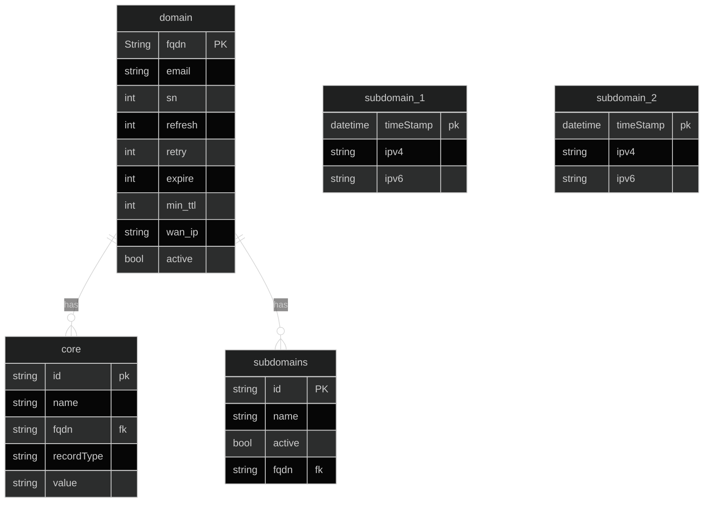

```mermaid
%%{init: {'theme':'dark'}}%%
erDiagram
	domain {
		String fqdn PK
		string email
		int sn
		int refresh
		int retry
		int expire
		int min_ttl
		string wan_ip
		bool active		
	}
	subdomains {
		string id PK
		string name
		bool active
		string fqdn fk
	}
	core{
		string id pk
		string name
		string fqdn fk
		string recordType
		string value
	}
	subdomain_1{
		datetime timeStamp pk
		string ipv4
		string ipv6
	}
	subdomain_2{
		datetime timeStamp pk
		string ipv4
		string ipv6
	}
	domain ||--o{ core : "has"
	domain ||--o{ subdomains : "has"
```

subdomains.name = name of table stand alone tables
- subdomain_1
- subdomain_2
both are in the subdomains table